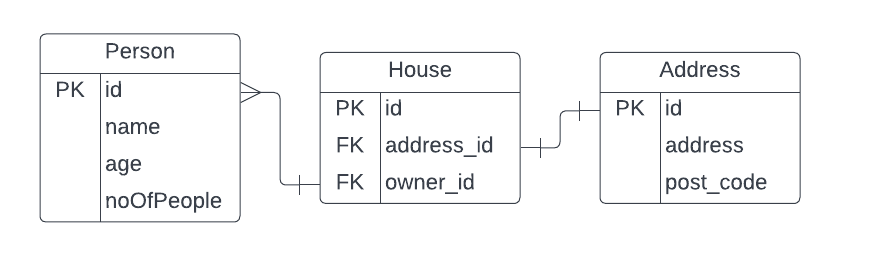

# Neighbourhood Collaboration Site

## Data Type - NoSQL

As we are using an API and plan to pass JSON data through HTTP requests, NoSQL is appropriate as the data is stored in a format similar to JSON.

## Schema

## Requests

The API must be able to handle all CRUD operations.

* POST

POST requests are used to create data in the database. This can be used to store new data about people, houses and adderesses.

* GET

GET requests are used to read data from the database. Can be used to look up a house, address and owner.

* PUT

PUT requests are used to update the database. Can be used when a house may have a new owner to change the current owner.

* DELETE

DELETE requests can be used to delete data from the database. Perhaps, if a house may be demolished the house record will be deleted from the database as it will no longer exist.

## Responses

GET request for person 
app.get (/owners/{person_name})
Returns the person object as JSON (200)

GET request for house address 
app.get (/owners/{person_name}/house)
Returns the house address as a string (200)

GET request for house address that doesn't exist 
app.get (/owners/{person_name}/house)
Returns the house doesn't exist (404)

POST request for new person 
app.post (/owners/{person_name})
Responds that the person has been added to the database (201)

POST request for existing person
app.post (/owners/{person_name})
Responds that the person already exists in the database (403)

PUT request for person
app.put (/owners/{person_name})
Responds that says the person has been updated (200/201)

DELETE request for house
app.delete (/owners/{person_name}/house)
Responds that the house has been deleted from the database (200/204)
